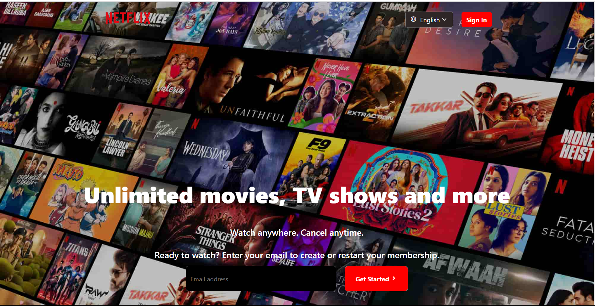
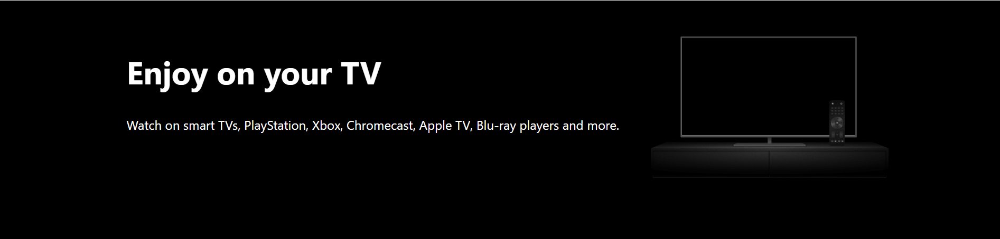
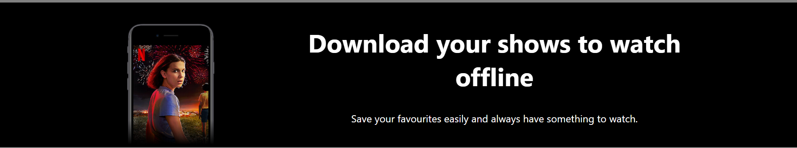
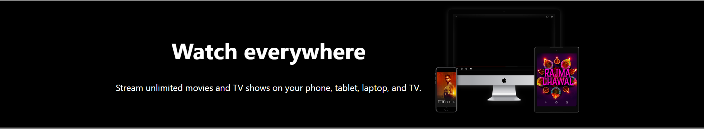
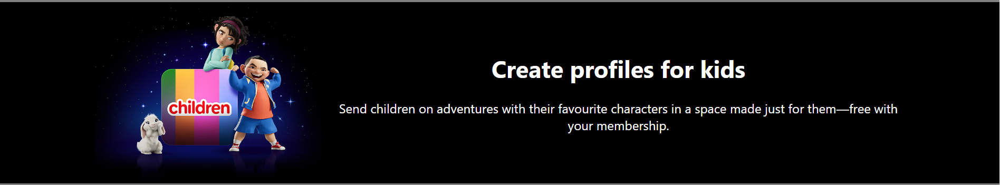
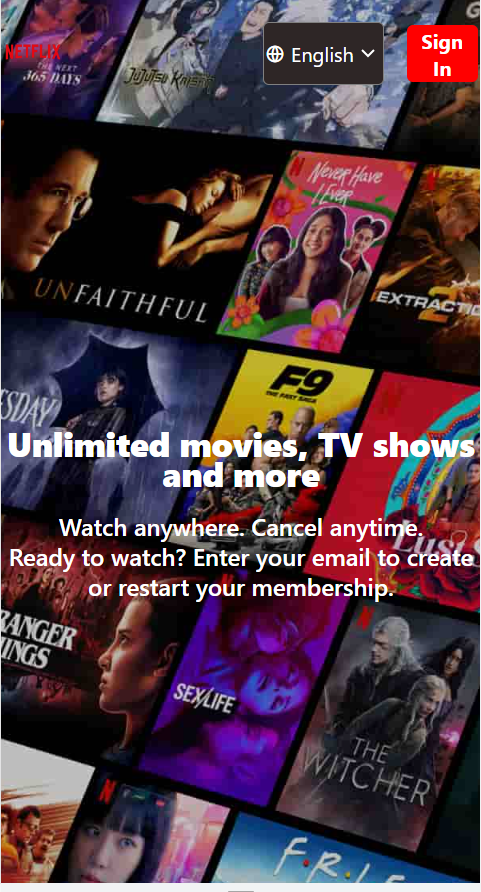
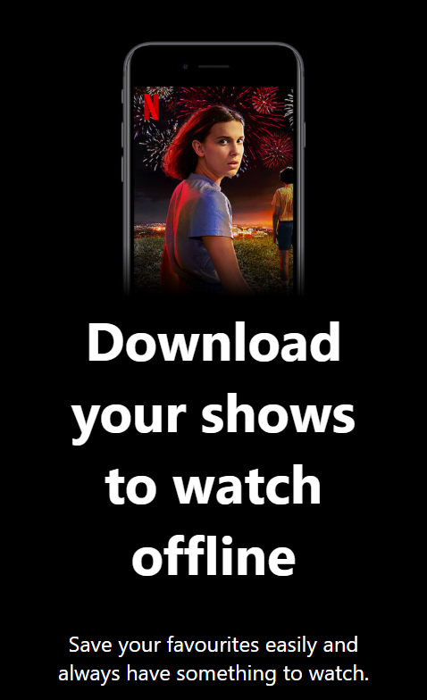
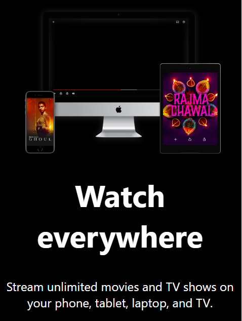
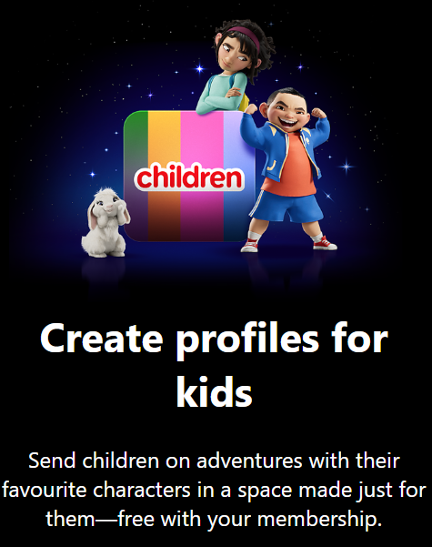
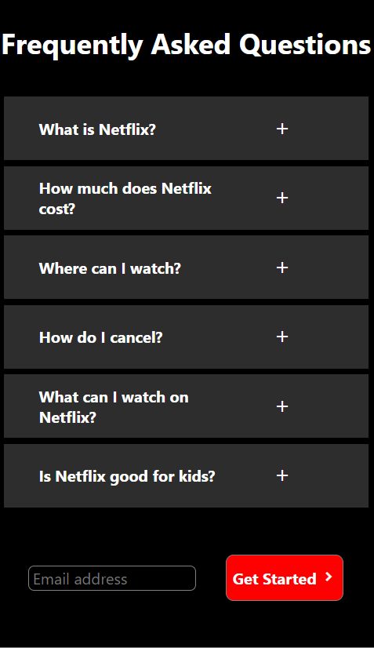

# Netflix India Front Page Clone

This repository contains a clone of the Netflix India front page created using pure HTML and CSS. The clone aims to replicate the layout and design of the original Netflix India website.

##Demo
You can see a live demo of the project here: https://ronaksharma57.github.io/MCT/


## Table of Contents

- [Usage](#usage)
- [Features](#features)
- [Contact](#contact)
- [Additional Information](#additional_information)


## Screenshots | Web Pages








## Screenshots | Mobile screen









## Features

- Responsive design: The clone is designed to be responsive and optimized for different screen sizes.
- Navigation menu: The navigation menu at the top of the page allows users to browse different sections of the website.
- Hero section: The hero section showcases a background image.
- Footer: The footer contains links to different sections of the website and social media links.

## Usage

To view the Netflix India clone, follow these steps:

1. Clone the repository:
```bash
git clone https://github.com/Ronaksharma57/MCT.git
```


2. Navigate to the project directory:
```bash
cd MCT
```


3. Open the `index.html` file in your preferred web browser.

## Additional_Information
 The project was created using the following tools:
- HTML
- CSS
- REMIXICON

The project was tested on the following browsers:
- Google Chrome
- Mozilla Firefox
## Author

#Ronak Sharma


## Contact

If you have any questions or suggestions, please feel free to contact me at
```bash
 sharmaronak57@gmail.com
 ```
